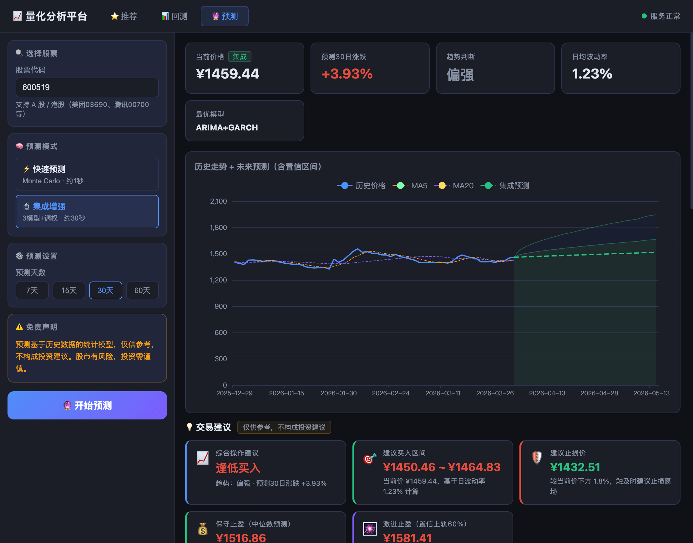
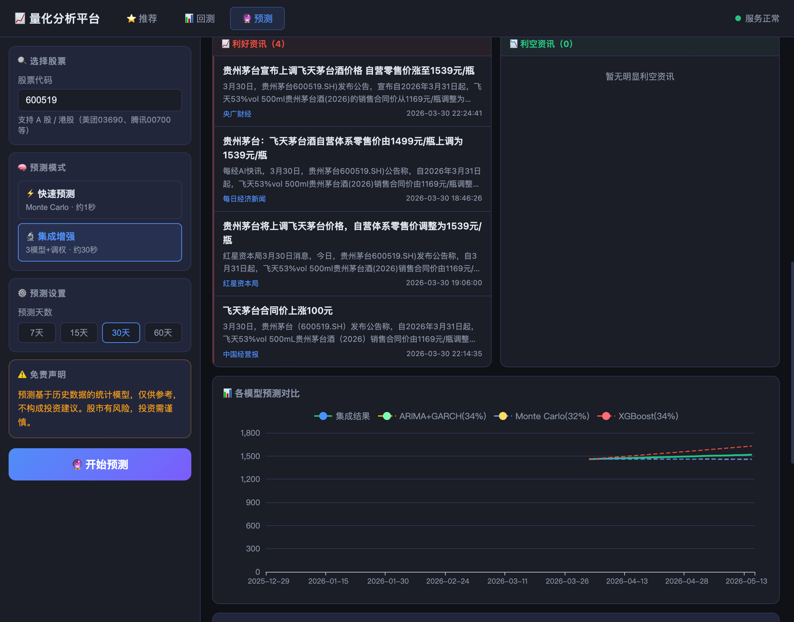
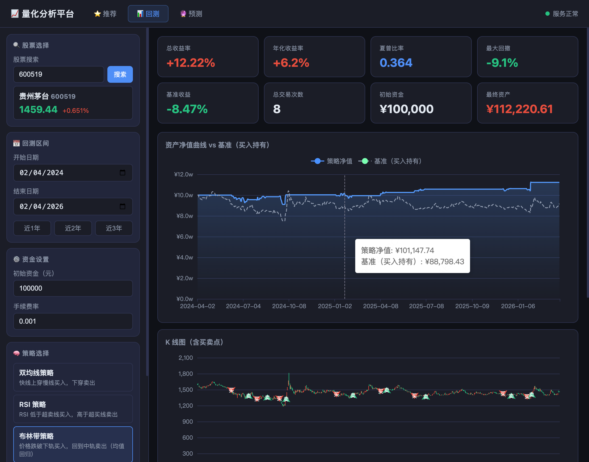

# 📈 量化分析平台

一个基于 Python + Flask + ECharts 的本地量化交易平台，支持 A 股与港股的策略回测、价格预测和智能选股推荐。

## ✨ 功能概览

### 📊 策略回测

对指定股票在历史区间内运行量化策略，输出净值曲线、交易记录和绩效指标。

- **支持策略**：双均线（MA Cross）、RSI 超买超卖、布林带均值回归
- **支持市场**：A 股（6 位代码）、港股（5 位代码）
- **数据来源**：A 股走 baostock TCP 协议（前复权），港股走腾讯财经接口
- **仓位管理**：PercentSizer，每次买入使用可用资金的 95%
- **图表展示**：策略净值曲线 vs 基准（买入持有）曲线，K 线图，交易标记


### 🔮 价格预测

对单只股票未来 7 / 15 / 30 / 60 天的价格走势进行预测。

- **快速预测**：Monte Carlo 随机游走，约 1 秒出结果
- **集成增强**：ARIMA + XGBoost + 线性回归三模型集成，Walk-Forward 动态调权，约 30 秒
- **新闻情感**：抓取东方财富个股新闻，按利好 / 利空 / 中性关键词自动分类




### ⭐ 智能推荐

从全量 A 股（约 5000 只）中随机采样评分，筛选出综合得分最高的股票。

- **多因子评分**：动量（30%）、相对强弱（20%）、趋势加速度（15%）、均线多头排列（15%）、波动率（10%）、量价配合（5%）、RSI 合理区间（5%）
- **行业筛选**：支持按申万一级行业（31 个）过滤候选池
- **抽样控制**：可自定义抽样数量（20 ~ 200 只），前端实时展示"采样 X 只 → 成功评分 Y 只（N 只失败）"
- **SSE 流式进度**：评分过程实时推送进度条，无需等待全部完成
- **行业晴雨表**：展示申万一级行业当日涨跌幅热力图
- **历史记录**：推荐结果可保存，支持查看和删除历史



## 🛠 技术栈

| 层次 | 技术 |
|------|------|
| 后端框架 | Flask + Flask-CORS |
| 回测引擎 | backtrader |
| 数据源 | baostock（A 股）、腾讯财经（港股）、akshare（新闻 / 行业） |
| 预测模型 | statsmodels ARIMA、XGBoost、scikit-learn |
| 前端图表 | ECharts 5 |
| 前端样式 | 原生 CSS（深色主题） |

## 🚀 快速开始

### 1. 克隆项目

```bash
git clone ssh://git@git.sankuai.com/~wanwenbo/ai_stock.git
cd ai_stock_analysis
```

### 2. 创建虚拟环境并安装依赖

```bash
# 创建虚拟环境（推荐 Python 3.10+）
python3 -m venv venv

# 激活虚拟环境
# macOS / Linux
source venv/bin/activate
# Windows
venv\Scripts\activate

# 安装全部依赖
pip install -r requirements.txt
```

> 依赖较多（含 XGBoost、statsmodels 等），首次安装约需 2～5 分钟。

### 3. 启动后端

```bash
python backend/app.py
```

首次启动会加载全量 A 股列表（约 20 秒），完成后访问：

```
http://localhost:5001
```

## 📁 项目结构

```
quant-platform/
├── backend/
│   ├── app.py            # Flask 主服务，所有 API 路由
│   ├── engine.py         # 回测引擎（backtrader 封装）
│   ├── recommender.py    # 多因子选股推荐模块
│   ├── predictor.py      # 快速预测（Monte Carlo）
│   ├── predictor_v2.py   # 集成增强预测（三模型 + Walk-Forward）
│   ├── model_arima.py    # ARIMA 模型
│   └── model_xgb.py      # XGBoost 模型
├── frontend/
│   ├── index.html        # 单页应用入口
│   └── static/
│       ├── css/style.css
│       └── js/main.js
├── data/
│   └── rec_history.json  # 推荐历史持久化
└── docs/
    ├── screenshot-backtest.png
    ├── screenshot-predict.png
    └── screenshot-recommend.png
```

## 📡 API 接口

| 方法 | 路径 | 说明 |
|------|------|------|
| GET | `/api/search_stock?keyword=` | 股票模糊搜索 |
| POST | `/api/backtest` | 执行策略回测 |
| GET | `/api/strategies` | 获取策略列表 |
| GET | `/api/predict?symbol=&days=` | 快速价格预测 |
| GET | `/api/predict_v2?symbol=&days=` | 集成增强预测 |
| GET | `/api/stock_news?symbol=` | 个股新闻情感分析 |
| GET | `/api/recommend_stream` | SSE 流式推荐（含进度） |
| GET | `/api/industries` | 获取行业列表 |
| GET | `/api/industry_heatmap` | 行业晴雨表 |
| GET/POST | `/api/rec_history` | 推荐历史读写 |
| DELETE | `/api/rec_history/<id>` | 删除历史记录 |

## ⚠️ 注意事项

- 本平台仅供学习研究，不构成任何投资建议
- 回测结果基于历史数据，不代表未来表现
- 港股数据通过腾讯财经接口获取，可能存在延迟
- 推荐模块采样存在随机性，每次结果可能不同
